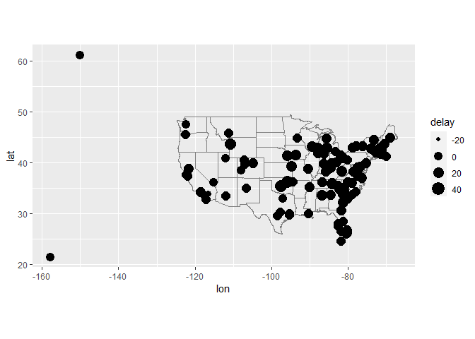
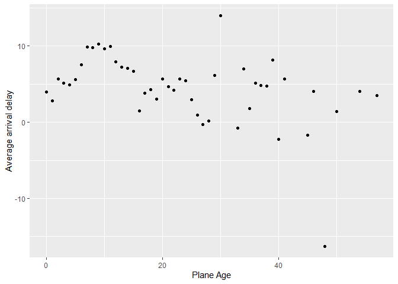
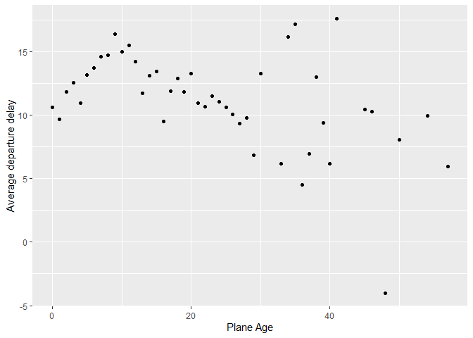

README
================
Xinkai Shen
10/18/2022

## q1

``` r
flights %>%
  group_by(dest) %>%
  summarise(delay = mean(arr_delay, na.rm = T)) %>%
  inner_join(airports, c("dest" = "faa")) %>%
  ggplot(aes(lon, lat, size = delay)) +
    borders("state") +
    geom_point() +
    coord_quickmap()
```

    ## Warning: Removed 1 rows containing missing values (geom_point).

<!-- -->

## q2

``` r
loc = airports %>%
  select(faa, lat, lon)

flights %>%
  select(year:day, hour, origin, dest) %>%
  left_join(loc, by = c("origin" = "faa")) %>%
  left_join(loc, by = c("dest" = "faa"))
```

    ## # A tibble: 336,776 x 10
    ##     year month   day  hour origin dest  lat.x lon.x lat.y lon.y
    ##    <int> <int> <int> <dbl> <chr>  <chr> <dbl> <dbl> <dbl> <dbl>
    ##  1  2013     1     1     5 EWR    IAH    40.7 -74.2  30.0 -95.3
    ##  2  2013     1     1     5 LGA    IAH    40.8 -73.9  30.0 -95.3
    ##  3  2013     1     1     5 JFK    MIA    40.6 -73.8  25.8 -80.3
    ##  4  2013     1     1     5 JFK    BQN    40.6 -73.8  NA    NA  
    ##  5  2013     1     1     6 LGA    ATL    40.8 -73.9  33.6 -84.4
    ##  6  2013     1     1     5 EWR    ORD    40.7 -74.2  42.0 -87.9
    ##  7  2013     1     1     6 EWR    FLL    40.7 -74.2  26.1 -80.2
    ##  8  2013     1     1     6 LGA    IAD    40.8 -73.9  38.9 -77.5
    ##  9  2013     1     1     6 JFK    MCO    40.6 -73.8  28.4 -81.3
    ## 10  2013     1     1     6 LGA    ORD    40.8 -73.9  42.0 -87.9
    ## # ... with 336,766 more rows

## q3

``` r
qu3 = flights %>%
  inner_join( planes %>%
    mutate(year_old =  year) %>%
    select(tailnum,year_old) , c(tailnum = "tailnum")) %>%
  mutate(year_old = year - year_old ) %>%
  group_by(year_old) %>%
  summarise(delay_arr = mean(arr_delay, na.rm = T), delay_dep = mean(dep_delay, na.rm = T))

qu3 %>%
  ggplot(aes(x = year_old, y = delay_arr)) +
    geom_point() +
    labs(x = 'Plane Age', y = 'Average arrival delay' )
```

    ## Warning: Removed 1 rows containing missing values (geom_point).

<!-- -->

``` r
qu3 %>%
  ggplot(aes(x = year_old, y = delay_dep)) +
    geom_point() +
    labs(x = 'Plane Age', y = 'Average departure delay' )
```

    ## Warning: Removed 1 rows containing missing values (geom_point).

<!-- -->
